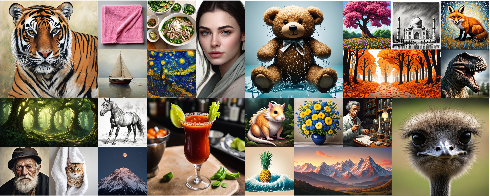
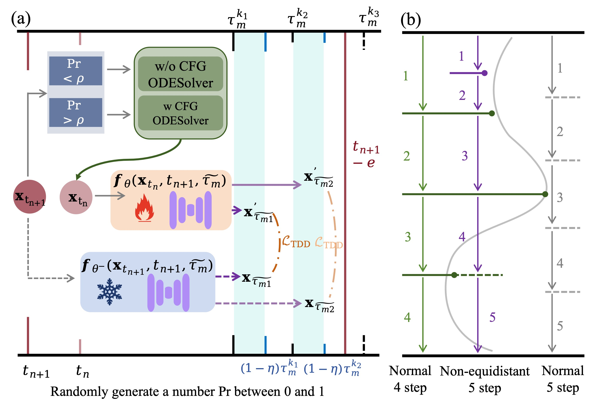
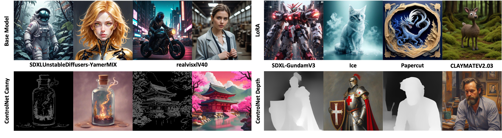

<div align="center">

# ✨Target-Driven Distillation✨

[](https://arxiv.org)
[](https://huggingface.co/RED-AIGC/TDD)
[](https://redaigc.github.io/TDD)

</div>

Target-Driven Distillation (TDD) is a state-of-the-art consistency distillation model that largely accelerates the inference processes of diffusion models. Using its delicate strategies of *target timestep selection* and *decoupled guidance*, models distilled by TDD can generated highly detailed images with only a few steps.

<div align="center">
  

  Samples generated by TDD-distilled SDXL, with only 4--8 steps.
</div>


## News

- **Aug. 29, 2024**: We have released codes for training and inference, as well as the pretrained models both w/ and w/o adv, on SDXL.
- **Aug. 22, 2024**: Project launched.

## Usage

### Inference
- Clone this repository.
```shell
git clone https://github.com/RedAIGC/Target-Driven-Distillation.git
cd Target-Driven-Distillation
```

- Download pretrained models with the script below or from [](https://huggingface.co/RED-AIGC/TDD).
```python
from huggingface_hub import hf_hub_download
hf_hub_download(repo_id="RedAIGC/TDD", filename="sdxl_tdd_lora_weights.safetensors", local_dir="./tdd_lora")
```

- Generate images.
```python
# !pip install opencv-python transformers accelerate 
import torch
import diffusers
from diffusers import StableDiffusionXLPipeline
from tdd_scheduler import TDDScheduler

device = "cuda"
tdd_lora_path = "tdd_lora/sdxl_tdd_lora_weights.safetensors"

pipe = StableDiffusionXLPipeline.from_pretrained("stabilityai/stable-diffusion-xl-base-1.0", torch_dtype=torch.float16, variant="fp16").to(device)

pipe.scheduler = TDDScheduler.from_config(pipe.scheduler.config)
pipe.load_lora_weights(tdd_lora_path, adapter_name="accelerate")
pipe.fuse_lora()

prompt="A photo of a cat made of water."

image = pipe(
    prompt=prompt,
    num_inference_steps=4,
    guidance_scale=1.7,
    eta=0.2, 
    generator=torch.Generator(device=device).manual_seed(546237),
).images[0]

image.save("tdd.png")
```

### Training

See scripts under [train](https://github.com/RedAIGC/Target-Driven-Distillation/tree/main/train).


## Introduction

Target-Driven Distillation (TDD) features three key designs, that differ from previous consistency distillation methods.
1. **TDD adopts a delicate selection strategy of target timesteps, increasing the training efficiency.** Specifically, it first chooses from a predefined set of equidistant denoising schedules (*e.g.* 4--8 steps), then adds a stochatic offset to accomodate non-deterministic sampling (*e.g.* $\gamma$-sampling).
2. **TDD utilizes decoupled guidances during training, making itself open to post-tuning on guidance scale during inference periods.** Specifically, it replaces a portion of the text conditions with unconditional (*i.e.* empty) prompts, in order to align with the standard training process using CFG.
3. **TDD can be optionally equipped with non-equidistant sampling and x0 clipping, enabling a more flexible and accurate way for image sampling.**

<div align="center">
  

  An overview of TDD. (a) The training process features target timestep selection and decoupled guidance. (b) The inference process can optionally adopt non-equidistant denoising schedules.
</div>

<div align="center">
  

  Samples generated by SDXL models distilled by mainstream consistency distillation methods LCM, PCM, TCD, and our TDD, from the same seeds. Our method demonstrates advantages in both image complexity and clarity.
</div>

<div align="center">
  

  Samples generated by TDD-distilled different base models, and by SDXL with different LoRA adapters or ControlNets.  
</div>

For further details of TDD, please refer to our paper: [](https://arxiv.org).

## Acknowledgements
- Thanks to the [PCM](https://github.com/G-U-N/Phased-Consistency-Model) PCM team for their ADV_loss support!
- Thanks to the [HuggingFace](https://github.com/huggingface) gradio team for their free GPU support!


## Concact, Collaboration, and Citation

If you have any questions about the code, please do not hesitate to contact me!

Email: polu@xiaohongshu.com

<!-- If you find TDD helpful to your research, please cite our paper:
```
@article{Wang2024TDD,
  title     = {Target-Driven Distillation: Consistency Distillation with Target Timestep Selection and Decoupled Guidance},
  author    = {Cunzheng Wang and Ziyuan Guo and Yuxuan Duan and Huaxia Li and Nemo Chen and Xu Tang and Yao Hu},
  journal   = {arXiv preprint arXiv:xxxx.xxxxx},
  year      = {2024}
}
``` -->
